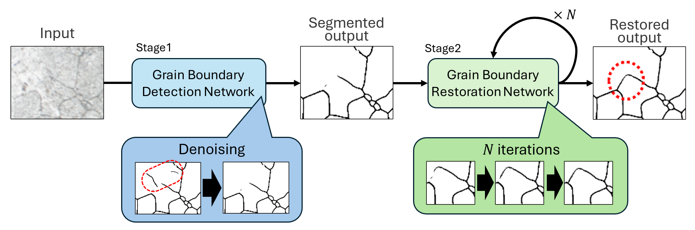
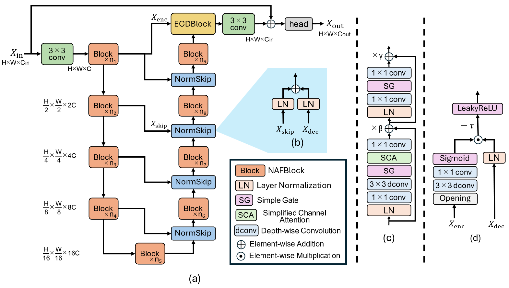

## Dual-CGB: Dual-stage Continuous Grain Boundary detection framework

This is the official PyTorch implementation of the paper [Deep Learning-Based Grain Boundary Detection in Polycrystalline Metals via Self-Supervised Boundary Restoration (Materials Today Communications, 2026)]()

> **Abstract:** This study proposes the Dual-stage Continuous Grain Boundary (Dual-CGB) detection framework to automatically and accurately extract grain boundaries from microstructural images of polycrystalline metals. Conventional deep learning methods often produce discontinuous boundaries and misclassify noise, hindering quantitative grain evaluation. Dual-CGB overcomes this through two stages using modified NAFNet architectures. In the first detection stage, we introduce an Encoder-Guided Denoising (EGD) Block and NormSkip to suppress false boundary detections by leveraging encoder features for noise removal. In the second restoration stage, discontinuous boundaries are reconnected using an edge-generation network trained with adversarial learning and fine-tuned using a topology-aware loss. To address the scarcity of annotated data, we employ a patch-based data augmentation strategy—extracting overlapping patches with rotation and flipping—combined with majority voting during inference. Experimental results demonstrate that Dual-CGB effectively suppresses noise and successfully reconnects fragmented boundaries. Compared to conventional models, our method achieves superior accuracy in boundary continuity and quantitative material metrics, such as grain count and average grain size distributions, proving its effectiveness for practical microstructural analysis.

## Overall pipeline of the Dual-CGB
<p align="center">
   

## Overall pipeline of the grain boundary detection network
<p align="center">
   
  
## :pushpin: Installation
```python
python 3.12.3
pytorch 2.9.0
cuda 13.0
```

Clone our repository and then install dependencies:
```bash
git clone https://github.com/n-okt/Dual_CGB.git
cd Dual_CGB
pip install -r requirements.txt
```

## :pushpin: Training and Evaluation
The 4340 Steel dataset primarily used in our paper cannot be released publicly. Here, we explain how to run training, validation, and testing with the 316L Grains dataset.

### :memo: Data preparation
#### 1. Download the 316L Grains dataset ([kaggle](https://www.kaggle.com/datasets/peterwarren/voronoi-artificial-grains-gen)). 
   
After downloading, it should be like this:
```
./dataset/
└── 316L_Grains/
    ├── GRAD_PRE/
    ├── HED_PRE/
    ├── RG/
    ├── RGMask/
    ├── THRESH_PRE/
```

#### 2. Generate full-size images. (Note: This step is specific to the 316L Grains dataset.)
Run the following to merge the cropped images and generate full-size images for testing. After execution, verify that the 'RG_merged' and 'RGMask_merged' directories are created in dataset/316L_Grains. 
```bash
python data_preparation/merge_316L_grain_patches.py
```

#### 3. Generate broken grain boundary images.
Run the following to synthetically generate broken grain boundary images for training the grain boundary restoration network. After execution, verify that the 'boundary_broken' directory is created in dataset/316L_Grains/.
```bash
python data_preparation/generate_broken_boundary.py
```

#### 4. Prepare cross-validation splits.
Run the following to prepare the training, validation, and test splits across multiple folds for cross-validation. After execution, verify that the 'cv_seg' directory is created in dataset/316L_Grains/.
```bash
python data_preparation/create_cv_splits_316l_grains.py
```

#### 5. Prepare cross-validation splits for grain boundary restoration.
Run the following to prepare the cross-validation data for grain boundary restoration based on cv_seg. After execution, verify that the 'cv_res' directory is created in dataset/316L_Grains/.
```bash
python data_preparation/create_cv_splits_broken_boundary.py
```

#### 6. Extract the ground-truth topology data.
Run the following to extract the topology data from the ground-truth images in advance for fine-tuning the grain boundary restoration network. After execution, verify that the 'topo' directory is created in dataset/316L_Grains/.
```bash
python get_topo_data.py
```

### :memo: Training
#### 1. Grain boundary detection
Run the following to train the grain boundary detection network. Training configurations can be modified in config/train_seg/316L_Grains.yaml.
```bash
python train_seg.py --config config/train_seg/316L_Grains.yaml
```

#### 2. Grain boundary restoration
Run the following to train the grain boundary restoration network. Training configurations can be modified in config/train_res/316L_Grains.yaml.
```bash
python train_res.py --config config/train_res/316L_Grains.yaml
```

#### 3. Fine-tuning
Run the following to fine-tune the grain boundary restoration network. Training configurations can be modified in config/finetune_res/316L_Grains.yaml.
```bash
python train_res.py --config config/finetune_res/316L_Grains.yaml
```

### :memo: Validation
Run the following to perform validation. Validation configurations can be modified in config/val/316L_Grains.yaml. This validation searches for the optimal combination of trained weights, noise suppression values, and restoration iterations. After validation, the best weight file and parameters will be saved in the result directory.
```bash
python val.py --config config/val/316L_Grains.yaml
```

### :memo: Evaluation
Run the following to perform inference. The optimal parameters (noise suppression values and restoration iterations) saved during validation are automatically used.
```bash
python test.py --config config/test/316L_Grains.yaml
```

## Citation
If you use Dual-CGB, please consider citing:

```
@article{Okitsu2026Dual_CGB,
  title={Deep Learning-Based Grain Boundary Detection in Polycrystalline Metals via Self-Supervised Boundary Restoration},
  author={Nagayuki Okitsu and Masato Shirai and Shigekazu Morito and Toru Watanabe and Hayato Ogino and Jun Sato},
  journal={Materials Today Communications},
  volume={},
  pages={},
  year={2026},
  doi={}
}
```

## Contact

If you have any question, please contact shirai@cis.shimane-u.ac.jp

